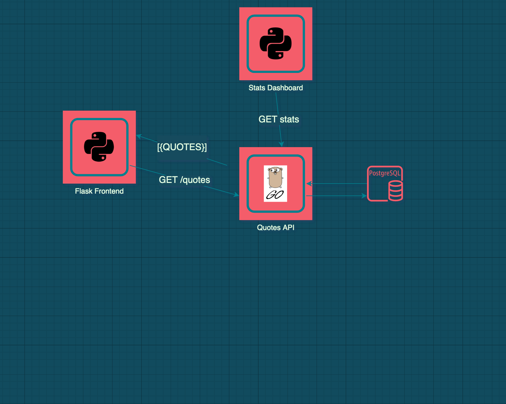

# Gopher Quotes 

Yet another application designed as a "MicRoserVice" for demo purposes. Gopher quotes offers users insghtful quotes ✍🏼 from their favourite gophers around the world. 🌍


## Architecture 🏗

Gopher Quotes is currently composed of three services, all of which communicate over HTTP.




| Service    | Language/framework | description                                        |
|------------|--------------------|----------------------------------------------------|
| quotes-frontend| python/flask   | renders quotes from the api                        |
| quotes-api | Go                 | handles creation of quotes                         |
| quote-stats| python/flask       | provides "useful" stats on quotes                  |


## Setup using Docker-Compose  :whale:

Starting the service is as easy as:

```bash
docker-compose up
```

## Setup using Kubernetes 

if you're into that kubernetes thing , I have provided some manifests in the deployments/k8s directory. Edit the following lines in `ingress.yaml` 

```yaml
 - host: "yourhostordomainname"
```
Now you can

```bash
kubectl apply -f deployments/k8s
```


## API endpoints 

The gopher quotes API exposes the two enpoints 

| METHOD | ENDPOINT |   
|--------|----------|
| GET    | /quotes  |  
| POST   | /create  |  
| GET    | /stats    |   

## Creating a quote

```bash
curl -d '{"title":"friendly reminder","body":"what you see is not what i get"}' -H "Content-Type: application/json" http://localhost:8080/create
```

## Sample Response

```json
{
  "title": "friendly reminder",
  "body": "what you see is not what i get"
}
```
